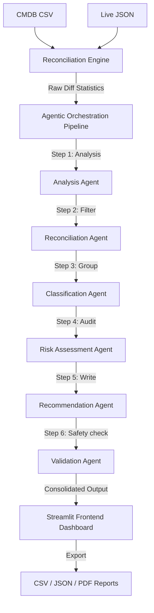
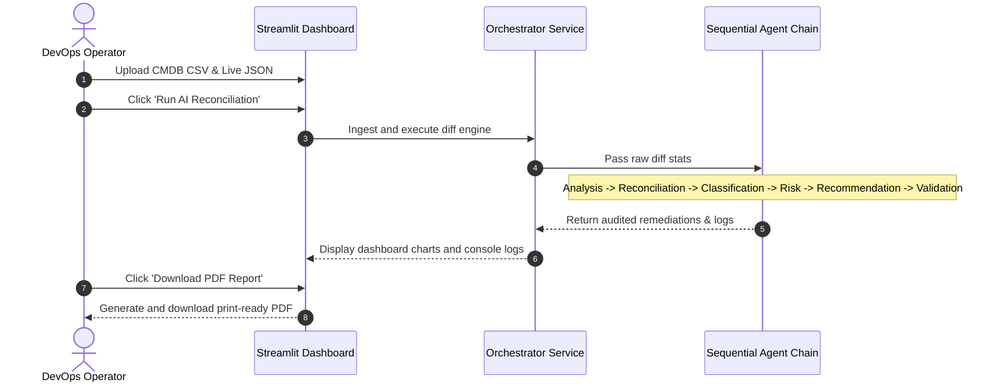

# InfraGuard: Agentic Inventory Reconciliation System

An AI-powered, multi-agent IT reconciliation engine that automatically detects, classifies, risk-assesses, and validation-audits configuration discrepancies between intended states (CMDB inventory) and discovered states (Live infrastructure).

### 🚀 [Live Demo Dashboard](https://inventory-reconciliation-tool-5kgzf46mbpi2poh9wuojz6.streamlit.app/)

---

## 👥 Team Members & Resumes
* **Team Name**: **Team 6**
* **Team Members**:
  * **Member 1**: **Mummana Akanksha** - Role: Full-Stack Developer & UI Architect
  * **Member 2**: **Kasireddy Jahnavi** - Role: Backend & Data Processing Engineer
  * **Member 3**: **Parsha Sri Harshitha** - Role: LLM Prompts & AI Integration Specialist
  * **Member 4**: **Doddi Harsha Sri** - Role: Quality Assurance & Documentation Engineer
* **Resumes**: Resumes for all team members are saved in PDF format in the [resumes](./resumes) folder (containing 10th, 12th, and Undergrad CGPA/Percentages).

---

## 🔗 Demo Video Link
* **Watch End-to-End Walkthrough**: https://www.loom.com/share/b81b5b9060c6407e84f43ccba4491e02

---

## 📖 Problem Statement

In enterprise DevOps environments, configuration drift, shadow IT (unregistered servers), and orphan decommissioning records are major compliance, security, and financial liabilities. Traditional reconciliations rely on manual spreadsheet checks or brittle rule-based alerts that lack contextual analysis (e.g. distinguishing a crashed server from an intentional deprovisioning) and offer no automated remediation steps.

**InfraGuard** solves this by combining high-speed structured matching (IP cross-referencing and Sequence Matching) with a **6-stage sequential AI Agent pipeline** that not only detects discrepancy drifts but generates safety-vetted script commands to sync the systems.

---

## ✨ Features

- **Ingestion & Reconciliation Engine**: Imports CMDB CSV records and Live JSON discovery results, performing name similarity calculations (SequenceMatcher) and IP cross-matching.
- **6-Agent Sequential Orchestration**:
  1. *Analysis Agent*: Evaluates high-level metrics and calculates an infrastructure health score.
  2. *Reconciliation Agent*: Consolidates raw difference maps and filters noise.
  3. *Classification Agent*: Groups drifts into *Shadow IT*, *Decommissioning Drift*, *Resource Allocation Drift*, *Network Drift*, *Service Outage*, etc.
  4. *Risk Assessment Agent*: Scores security impact, associates compliance violations (SOC 2, ISO 27001, PCI-DSS), and maps active CVE threats.
  5. *Recommendation Agent*: Generates targeted Ansible playbooks, PowerShell scripts, and Bash commands.
  6. *Validation Agent*: Intercepts dangerous operations, enforces environment-aware safety guardrails, and appends a rollback script.
- **Enterprise-Grade UI**: Built with Streamlit, custom CSS, Google Fonts, dark mode optimization, glassmorphic metric cards, and responsive charts.
- **Multi-Format Reports**: Downloader for CSV, full JSON workflow traces, and a print-ready PDF Executive Summary.
- **Dual-LLM & Recruiter Demo Mode**: Support for OpenAI API, local Ollama endpoints, and an offline, zero-credentials fallback demo mode.

---

## 🛠️ Tools & Technologies Used
* **Frontend UI Dashboard**: Streamlit (Python-based data application framework)
* **Data Processor**: Pandas, NumPy (High-speed tabular matching engine)
* **Visualization & Plotting**: Plotly Express (Dynamic, interactive pie and bar charts)
* **Test Suite**: Pytest (Happy-path and structure integrity unit tests)
* **Report Exporter**: fpdf2 (Lightweight, zero-binary dependency PDF builder)
* **AI Orchestration**: Custom sequential agent loop pipeline (supporting OpenAI, local Ollama, and zero-credential Mock Demo Mode)

---

## 📥 Sample Input & Expected Output Preview

### Sample Input Data (Saved in `/data` folder)
1. **CMDB Inventory Database (`/data/cmdb_inventory.csv`)**: Contains intended state registry for 6 corporate servers with IP address, owner, OS version, CPU, and RAM.
2. **Live Discovered State (`/data/live_inventory.json`)**: Simulated scan result showing active nodes. Includes an unregistered machine (`dev-sandbox-test-temp`), a shifted database name (`prod-db-pg-01`), and drifted memory sizes.

### Expected Output Reports (Saved in `/outputs` folder)
1. **Tabular Results (`/outputs/sample_output.csv`)**: A spreadsheet listing target assets, anomaly category, risk level, risk score, target system, and validation checks.
2. **Executive Report (`/outputs/final_report.md`)**: A detailed Markdown document detailing health score calculations, SOC 2/PCI compliance issues, and automated Ansible/Bash remediation scripts.

---

## 🤖 AI Capability Demonstrated
* **Agent Loop Workflow (Section 9)**: The application utilizes a sequential multi-agent chain where data flows through 6 distinct agents. Each agent consumes the structured JSON output of the previous agent, performs its specific task (e.g. classification, risk scoring, or writing Ansible playbooks), validates formatting, and passes it forward.

---

## 🏗️ Architecture

### High-Level Architecture & Data Flow



### Agent Workflow Diagram



---

## 🚀 Installation & Local Setup

### Prerequisites
- Python 3.9, 3.10, or 3.11
- Git

### Steps
1. **Clone the repository**:
   ```bash
    git clone https://github.com/akankshamummana-875/Inventory-Reconciliation-Tool.git
    cd Inventory-Reconciliation-Tool
   ```

2. **Create and activate a virtual environment**:
   ```bash
   python -m venv venv
   # On Windows:
   .\venv\Scripts\activate
   # On macOS/Linux:
   source venv/bin/activate
   ```

3. **Install dependencies**:
   ```bash
   pip install -r requirements.txt
   ```

4. **Run the Streamlit application**:
   ```bash
   streamlit run app.py
   ```
   Open your browser and navigate to `http://localhost:8501`.

5. **Load Demo Data**:
   Click the **💡 Load Default Demo Datasets** button to immediately run the reconciliation pipeline using pre-loaded configurations.

---

## 🐳 Docker Deployment

To build and run the application locally inside a container:

```bash
# Build the Docker image
docker build -t infraguard-app .

# Run the container exposing port 8501
docker run -p 8501:8501 infraguard-app
```
Access the application at `http://localhost:8501`.

---

## 🧪 Testing

The codebase includes standard unit tests covering reconciler rules and mock agent outputs. To execute the tests, run:

```bash
# Run tests with pytest
pytest tests/
```

---

## ⚙️ Configuration & Environment Variables

You can configure LLM providers by creating a `.env` file in the project root:

```env
# Can be 'demo', 'openai', or 'ollama'
LLM_PROVIDER=demo

# If using OpenAI:
OPENAI_API_KEY=your_openai_api_key
OPENAI_MODEL=gpt-4o-mini

# If using local Ollama:
OLLAMA_API_BASE=http://localhost:11434/api
OLLAMA_MODEL=llama3
```

---

## 📝 Assumptions & Limitations

- **Naming Conventions**: String similarity matching assumes that drifted names share at least 75% character overlap. For servers with completely different naming structures, they must share a common IP address in both databases to be classified as a naming mismatch, otherwise they will be logged as one missing and one untracked host.
- **Agent Token Lengths**: To keep LLM usage cost-effective and prevent timeout thresholds, the analysis engine groups and summarizes large raw tables before feeding them into prompts.
- **Local Ollama Availability**: When utilizing `Ollama (Local)`, the Ollama daemon must be running at the configured endpoint and the target model (e.g. `llama3`) must be pulled in advance.
